# Structured programming in software project
# Lập trình cấu trúc trong dự án phần mềm  
## Nội dung đưọc đề cập  
* Tổng quan
* Cấu trúc của một chương trình
* Tách mối quan tâm

## Mục tiêu
* Sau bài học này, sinh viên có thể:  
	* Nhắc lại được những thuật ngữ về lập trình cấu trúc  
	* Tóm tắt đưọc mối quan hệ giữa chất lượng phần mềm, giải thuật và cấu trúc chương trình  
	* Xây dựng sự tách biệt giữa các mối quan tâm  
------

## Tổng quan  
1. Giới thiệu  
* Kĩ thuật phần mềm = các hoạt động giải quyết vấn đề  
	* Hiểu vấn đề  
	* Thiết kế giải thuật cho giải pháp  
	* Triển khai giải thuật trong chương trình máy tính  
* Giải thuật: Trình tự các bước từ đầu vào đến đầu ra để giải quyết vấn đề  
	* Sự chính xác: Cung cấp giải pháp đúng theo thông số kĩ thuật  
	* Tính hữu hạn: có sự kết thúc  
	* Tính chung: làm việc trong mọi trường hợp của vấn đề  
	* Tính hiệu quả: sử dụng ít tài nguyên (thời gian, bộ nhớ, băng thông, ...)  

-> Cần có một cách tiếp cận cấu trúc  

2. Lập trình cấu trúc  

### Lập trình cấu trúc là gì?  
* Ban đầu: lập trình mà không cần sư dụng câu lệnh GOTO  
* Sau đó: một phương pháp viết chương trình máy tính để giảm thiểu độ phức tạp của vấn đề  
	* phân tích từ trên xuống để giải quyết vấn đề  
	* module hóa cho cấu trúc chương trình và tổ chức  
	* mã có cấu trúc cho các module riêng lẻ  
* Hiện nay: một phương pháp thiết kế các thành phần phần mềm / yếu tố chương trình và mối quan hệ của chúng với:  
	* Giảm thiểu độ phức tạp  
	* Thích ứng với sự thay đổi (xác định các sửa đổi cho các chức năng bổ sung hoặc sửa lỗi)  
	* Cải thiện độ tin cậy và rõ ràng của các chương trình 

### Thiết kế có cấu trúc của phần mềm  
* Khái niệm hóa một vấn đề thành một số yếu tố được tổ chức tốt của giải pháp (chủ yếu dựa trên chiến lược “phân chia và chinh phục”)  
* Duy trì cấu trúc thống nhất ở các cấp độ khác nhau  
	* Giải quyết vấn đề: từ trên xuống, từ dưới lên, giữa chừng  
	* Tóm tắt và tổ chức chương trình: mô-đun, dịch vụ, chức năng, đối tượng, ...  
	* Yếu tố chương trình: mã có cấu trúc

3. Ưu điểm của lập trình cấu trúc  
* Chuỗi hoạt động đơn giản để theo dõi, do đó tạo điều kiện gỡ lỗi  
* Có một số hữu hạn các cấu trúc với thuật ngữ chuẩn hóa  
	* Cấu trúc cho vay dễ dàng để xây dựng các chương trình con  
	* Bộ cấu trúc hoàn tất; có nghĩa là, một chương trình có thể được viết bằng cách sử dụng các cấu trúc này  
* Các cấu trúc tự tài liệu và do đó dễ đọc.  
* Các cấu trúc dễ mô tả trong sơ đồ, sơ đồ cú pháp, mã giả, v.v.  
* Kết quả lập trình có cấu trúc trong chương trình tăng năng suất lập trình viên có thể được viết nhanh hơn.  

4. Nhược điểm của lập trình có cấu trúc  
* Một số ngôn ngữ cấp cao (Pascal, C, Java, Lisp, ...) chấp nhận cấu trúc trực tiếp; trong khi những người khác yêu cầu thêm một giai đoạn dịch thuật.  
* Trong một số trường hợp, các chương trình có cấu trúc có thể thực thi chậm hơn và yêu cầu nhiều bộ nhớ hơn so với quivalent không có cấu trúc.  
* Một số vấn đề (thiểu số) khó giải quyết hơn khi chỉ sử dụng ba cấu trúc chứ không phải là cách tiếp cận "spaghetti" mạnh mẽ.  
* Các cấu trúc lồng nhau có thể khó theo dõi.  

## Cấu trúc của chương trình  
1. Cấu trúc của chương trình máy tính  
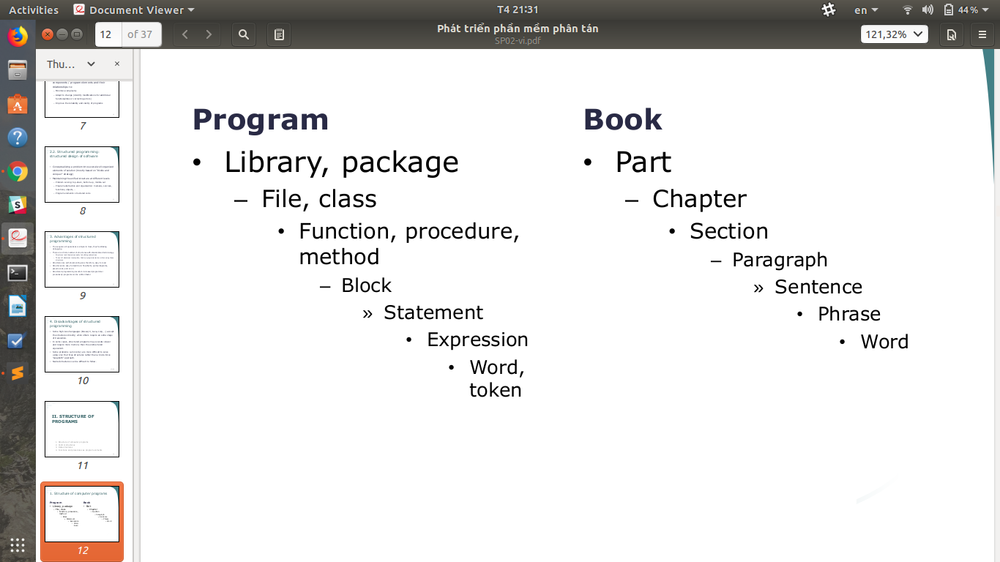  
2. Cấu trúc điều khiển  
* Chương trình máy tính đại diện cho một thuật toán giải quyết một vấn đề nhất định.  
* Tất cả các chương trình máy tính, dù đơn giản hay phức tạp như thế nào, đều được viết bằng một hoặc nhiều cấu trúc cơ bản:  
	* Trình tự  
	* Lựa chọn  
	* Lặp lại  
* Những cấu trúc này được gọi là cấu trúc điều khiển hoặc cấu trúc logic, bởi vì chúng kiểm soát logic chương trình  

### Cấu trúc chuỗi  
* Cấu trúc trình tự trong chương trình máy tính hướng máy tính xử lý các câu lệnh này đến cái khác, theo thứ tự được liệt kê trong chương trình  
* Một tuyên bố có thể là:  
	* Tuyên bố chuyển nhượng  
	* Báo cáo đầu vào / đầu ra  
	* Tuyên bố tổng hợp  

### Cấu trúc lựa chọn  
* Đưa ra quyết định và sau đó thực hiện hành động thích hợp dựa trên quyết định đó  
* Cung cấp hành động thích hợp để thực hiện dựa trên kết quả của quyết định đó  
* Quyết định phụ thuộc vào các giá trị điều kiện khác nhau  
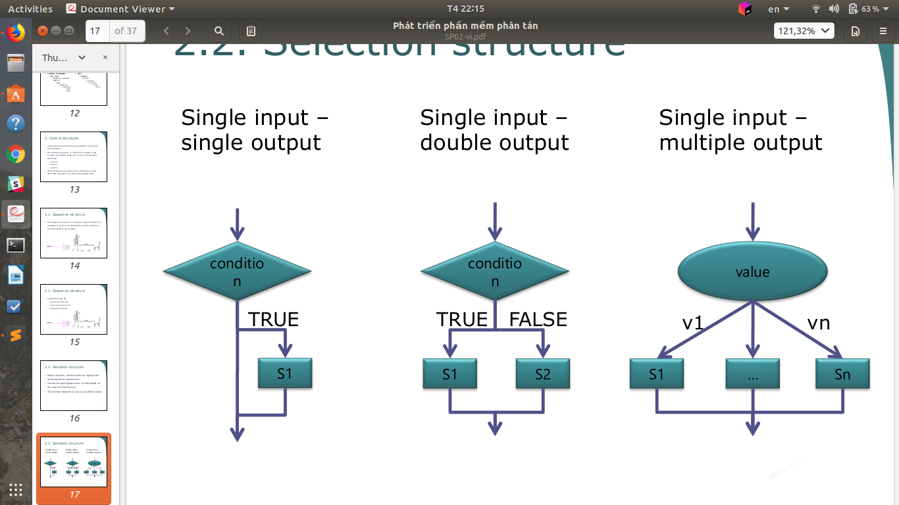  
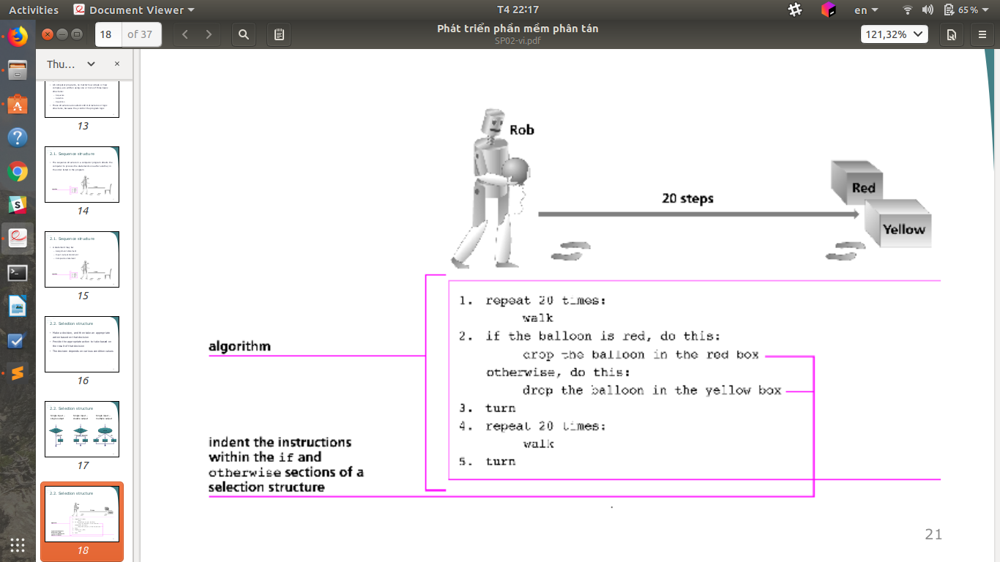  

### Cấu trúc lặp  
* Cho phép lập trình viên xác định rằng một hành động nên được lặp lại, tùy thuộc vào giá trị điều kiện  
* Khi được sử dụng trong một chương trình, cấu trúc lặp lại, cũng được gọi là vòng lặp, hướng máy tính lặp lại một hoặc nhiều câu lệnh cho đến khi một số điều kiện được đáp ứng, tại thời điểm đó máy tính nên dừng lặp lại câu lệnh  
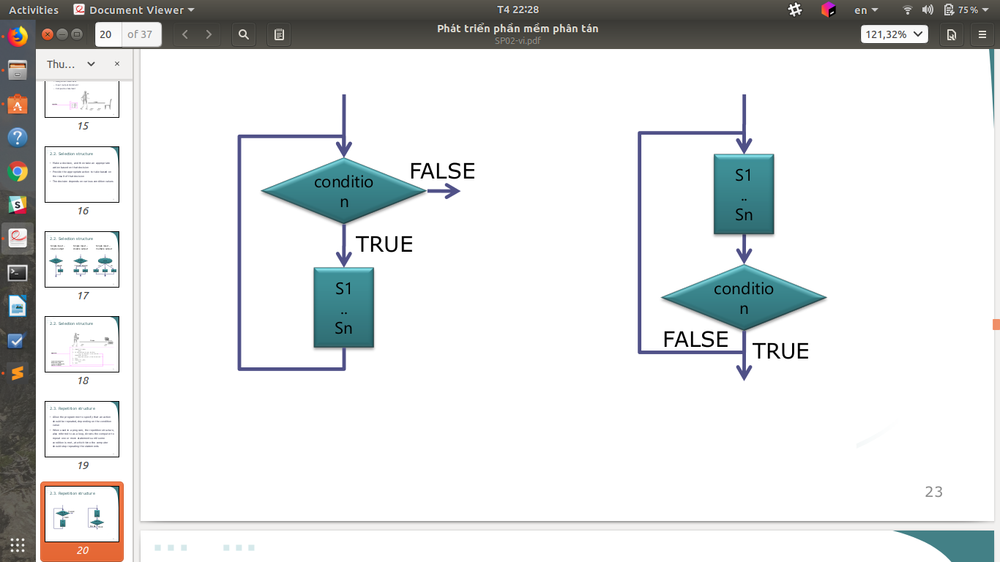  
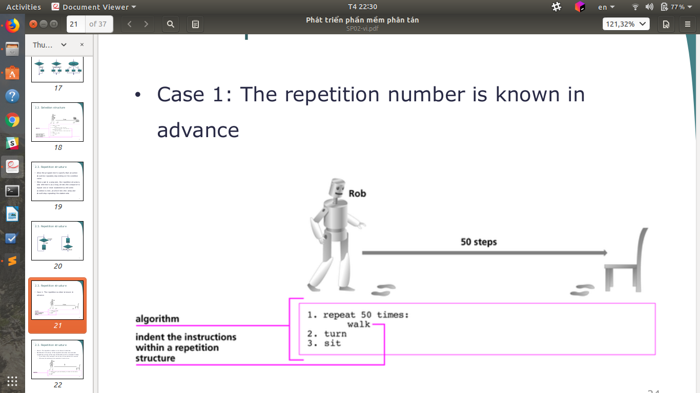  
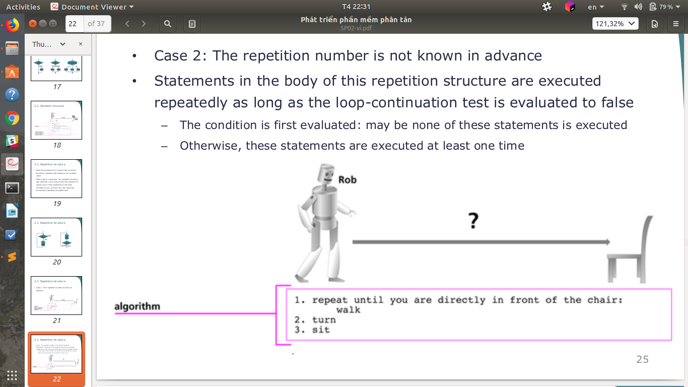  

3. Cấu trúc dữ liệu  
* Làm thế nào để lựa chọn hoặc đưa ra các cấu trúc dữ liệu thích hợp cho một vấn đề?
	* Thuật toán sẽ phải thao tác dữ liệu theo cách nào đó -> Cách chúng tôi chọn để lưu trữ và sắp xếp dữ liệu của chúng tôi (tức là cấu trúc dữ liệu) ảnh hưởng trực tiếp đến hiệu quả của thuật toán của chúng tôi  
	* Cấu trúc dữ liệu cổ điển: thiết kế, triển khai và sử dụng  

### Kiểu  
* Kiểu nguyên thủy  
	* Integer, Boolean, String, ...  
* Loại hỗn hợp  
	* Tuple  
* Kiểu dữ liệu trừu tượng: cấu trúc dữ liệu được định nghĩa gián tiếp bởi các hoạt động có thể được thực hiện trên nó và các đặc tính toán học của các hoạt động đó  
	* Array  
	* List  
	* Tree  
	* Hash  
	* Graph  
4. Các hàm và thủ tục làm phần tử chương trình  
* Chức năng và thủ tục là một phần của chương trình máy tính. Chúng có thể được định nghĩa tùy chỉnh.  
* Một hàm hoặc một thủ tục được xây dựng từ các cấu trúc điều khiển để thao tác trên các cấu trúc dữ liệu được xác định.  
* Các hàm là các quan hệ toán học thực sự mà ánh xạ mọi đầu vào đến chính xác một đầu ra. Các hàm được thiết kế để trả về giá trị đầu ra của chúng.  
* Thủ tục là công thức để tính toán thực hiện các tác dụng phụ.  
* Một trong hai chức năng hoặc thủ tục được **sử dụng để đại diện cho một mối quan tâm**  

### Ví dụ: Hàm và thủ tục  
* C, C ++, Java: không phân biệt  
* Pascal, .NET:  
	* Hàm trả về giá trị  
	* thủ tục không trả về giá trị.  
* DBMS:  
	* thủ tục (SPROCs): lưu trữ các truy vấn được biên dịch  
	* Hàm (UDFs): phần biểu thức dựng sẵn được sử dụng để tạo truy vấn  

## Tách mối quan tâm  
1. Nguyên tắc  
* Nguyên tắc phân tách các mối quan tâm nói rằng phần mềm nên được tổ chức sao cho mỗi phần tử chương trình thực hiện một điều và chỉ một điều.  
* Do đó, mỗi yếu tố chương trình nên dễ hiểu mà không cần tham chiếu đến các yếu tố khác.  
* Tóm tắt chương trình (thủ tục, đối tượng, vv) hỗ trợ việc phân tách các mối quan tâm.  
	* Các ngôn ngữ lập trình thủ tục như C và Pascal có thể tách mối quan tâm thành các thủ tục.  
	* Các ngôn ngữ lập trình hướng đối tượng như Java có thể tách các mối quan tâm thành các đối tượng.  
	* Kiến trúc hướng dịch vụ có thể tách mối quan tâm thành các dịch vụ.  

2. Mối quan tâm  
* Một mối quan tâm là một lĩnh vực quan tâm hoặc tập trung vào một hệ thống.  
* Mối quan tâm là tiêu chí chính để phân tích phần mềm thành nhỏ hơn, nhiều hơn các bộ phận có thể quản lý và dễ hiểu có ý nghĩa với kỹ sư phần mềm.  
	* Lập trình thủ tục, mô tả mối quan tâm như thủ tục  
	* Lập trình hướng đối tượng, mô tả các mối quan tâm như đối tượng  

3. Tác kiểu phân tách  
* Chất lượng: xử lý các khía cạnh chất lượng riêng biệt khác nhau của hệ thống  
	* Ví dụ: bảo mật  
* Thời gian: lập kế hoạch hoạt động của một hệ thống  
	* Ví dụ: vòng đời phần mềm  
* Xem: xem xét và phân tích riêng hệ thống  
	* Ví dụ: luồng điều khiển, luồng dữ liệu  
* Kích thước: thống trị độ phức tạp của hệ thống  
	* Ví dụ: thành phần  

4. Mối quan tâm của bên liên quan  
* Các mối quan tâm về chức năng: liên quan đến các chức năng cụ thể được đưa vào hệ thống  
* Chất lượng dịch vụ quan tâm: liên quan đến hành vi phi chức năng của một hệ thống  
* Mối quan ngại về chính sách: liên quan đến các chính sách tổng thể chi phối việc sử dụng hệ thống  
* Các mối quan tâm của hệ thống: liên quan đến các thuộc tính của toàn bộ hệ thống, chẳng hạn như khả năng bảo trì hoặc khả năng cấu hình của hệ thống  
* Mối quan ngại về tổ chức: liên quan đến các mục tiêu và ưu tiên của tổ chức như:  
	* tạo ra một hệ thống trong ngân sách  
	* tận dụng tài sản phần mềm hiện có  
	* duy trì danh tiếng của một tổ chức  

5. Ví dụ: Hệ thống ngân hàng  
* Mối quan tâm không phải là vấn đề của chương trình mà phản ánh các yêu cầu hệ thống và các ưu tiên của các bên liên quan hệ thống.  
* Bằng cách phản ánh sự tách biệt các mối quan tâm trong một chương trình, có bản đồ rõ ràng từ các yêu cầu để thực hiện.  
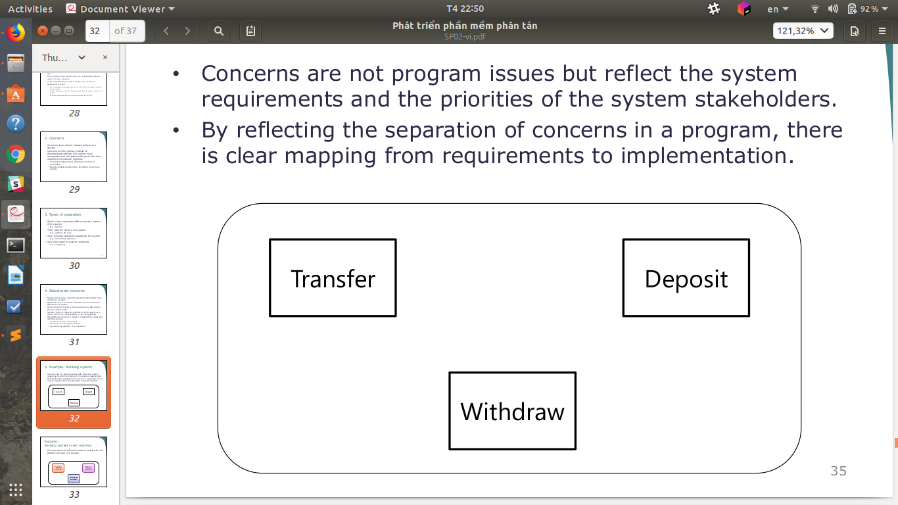  

### Ví dụ: Mối quan tâm cốt lõi của hệ thống ngân hàng  
Mối quan tâm chính: các mối quan tâm chức năng liên quan đến mục đích chính của một hệ thống  
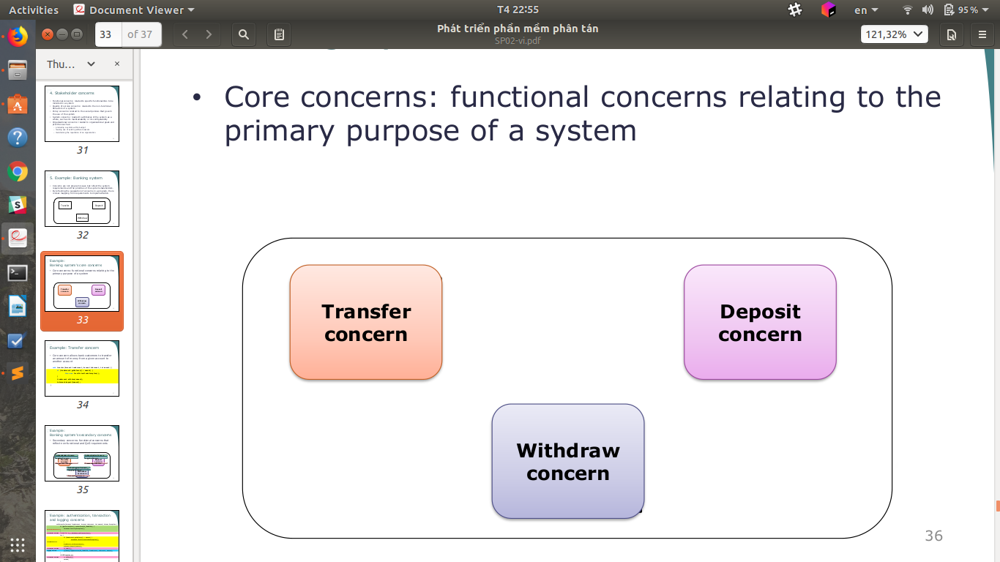  

### Ví dụ: Mối quan tâm chuyển tiền  
Mối quan tâm chính cho phép khách hàng của ngân hàng chuyển số tiền từ một tài khoản cụ thể sang một tài khoản khác  
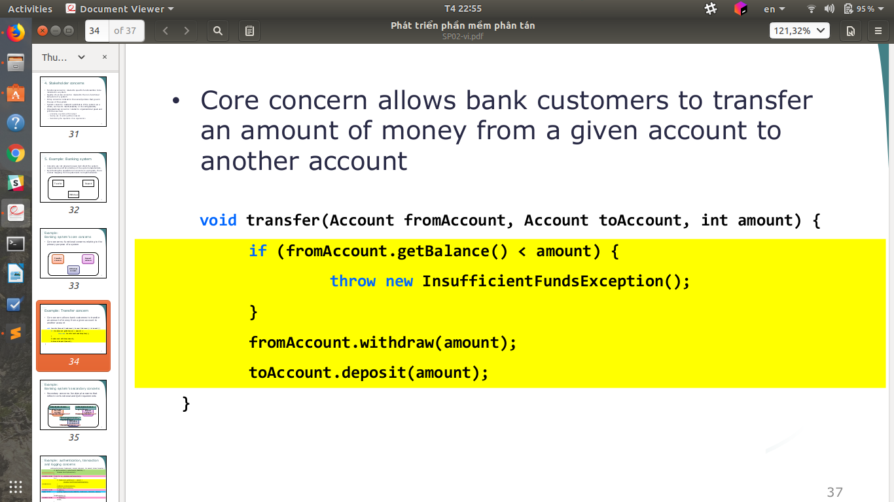  

### Ví dụ: Mối quan tâm thứ cấp của hệ thống ngân hàng  
Mối quan tâm thứ cấp: các mối quan tâm về chức năng phản ánh các yêu cầu không có chức năng và QoS  
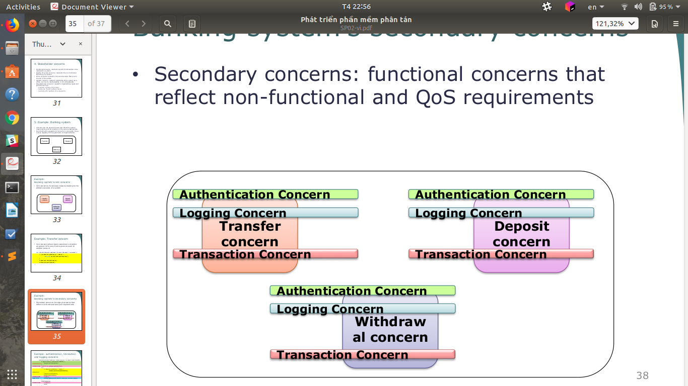  

### Ví dụ: các mối quan tâm về xác thực, giao dịch và ghi nhật ký  
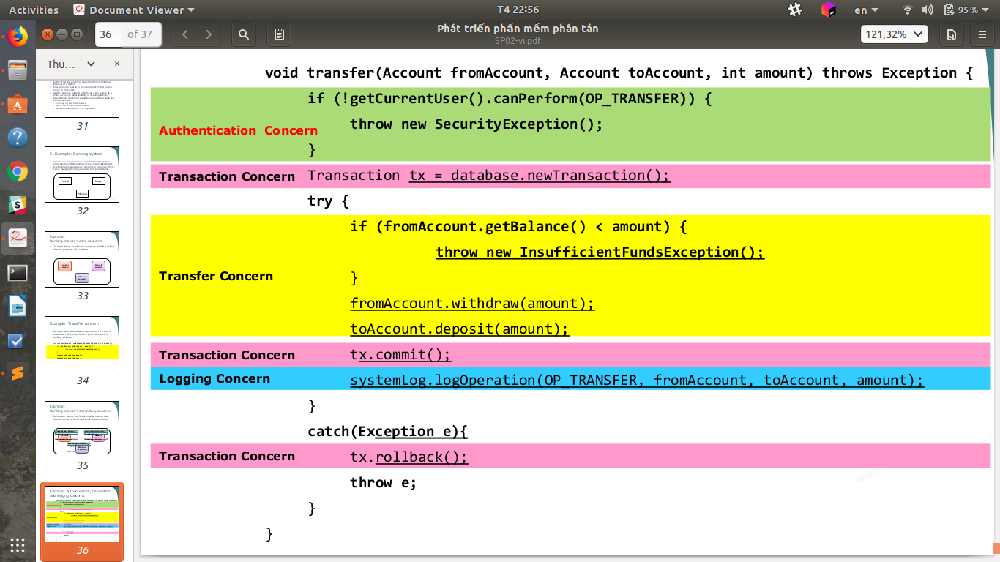  
